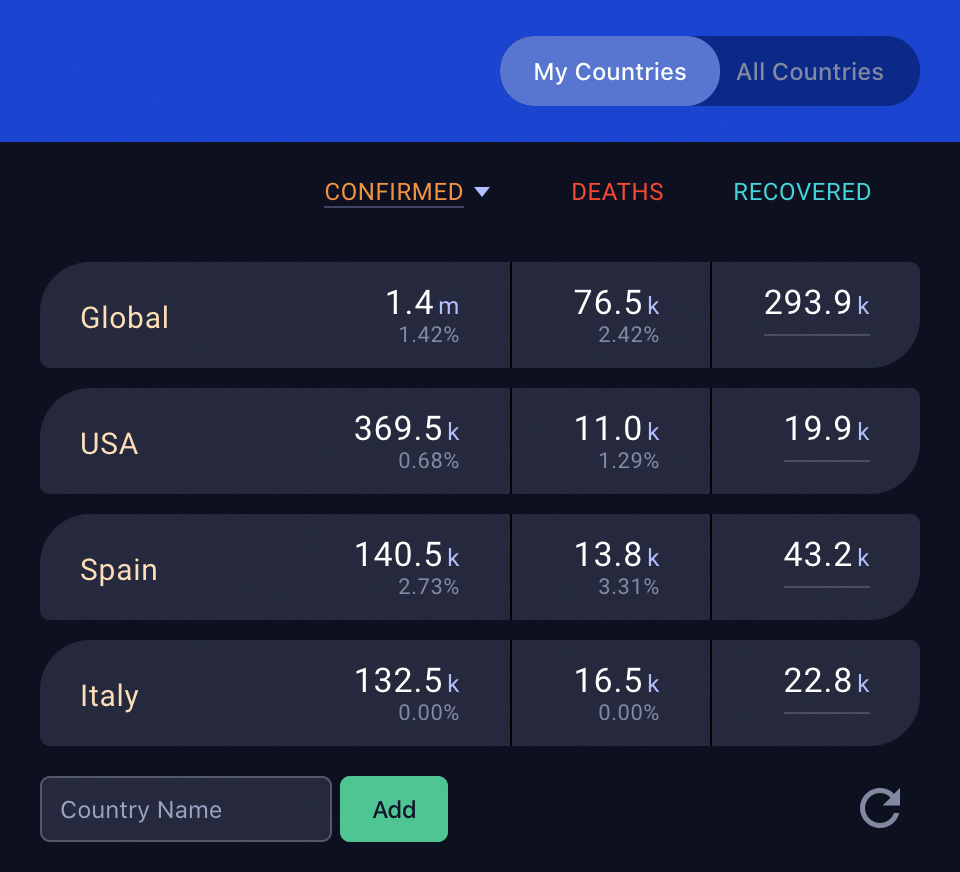

# COVID19 Tracker

A Chrome extension to show important COVID-19 global and local information.

[Available on the Chrome Store](https://chrome.google.com/webstore/detail/dccmmkjdbpdlcallijclmjkhmpciajdj/).

## Features
- Initialized with global stats and the top four countries with highest confirmed cases.
- Ability to curate the list of countries you want to keep an eye on.
- Data is refreshed each time extension is opened and can be refreshed manually with one click.
- Ability to sort the data by clicking on the headings.
- Panel to view data from all reporting countries at the same time.
- Your country data will persist between Chrome sessions by being stored in Chrome sync storage.

## Data
We are consuming the data from the [Corona Virus Monitor](https://rapidapi.com/astsiatsko/api/coronavirus-monitor?endpoint=apiendpoint_f48abf8b-68b3-4012-97ee-f0cc72cff406) API.

API information is updated on 10 minute intervals and consumes the data from [Johns Hopkins](https://coronavirus.jhu.edu/map.html) or [Worldometer](https://www.worldometers.info/coronavirus/) depending on which one has the most up to date information.

 

----

## Running the app locally

There are 2 ways to run the app locally, as a Chrome extension, and as a React web app. For development, the React web app way makes for a faster development process.

#### As a Chrome extension

1. Make the code changes you need
2. Run `npm run build`
3. In Chrome navigate to `chrome://extensions/`
4. Click load unpacked, and point to your `build` folder

Everytime you make code changes, you will need to rebuild the project and refresh the chrome extension to view your changes.

#### As a React web app

1. Inside of `App.js` comment out all code that references `chrome.storage` as Chrome storage is not available outside of the extension ecosystem. (Located in 3 places, `initializeState`, `addCountry`, `removeCountry`)
2. In `App.js` look for the comment starting with `// If running in react use the code...` and uncomment the 3 lines of code below.
3. `npm run start` will spin up a server on `http://localhost:3000/` - Now when you make changes to the code, the server will auto refresh your browser with the changes, no need to build the project everytime.
4. When ready to push your changes, make sure to revert the Chrome storage changes. (Be sure not to uncomment `chrome.storage.sync.remove('userStorage');` otherwise the users chrome storage will be cleared everytime the app is run, this is there only for testing)

----

 

This was authored by [Mariusz Dabrowski](https://github.com/MariuszDabrowski) & [Dulio Denis](https://github.com/duliodenis) for a Hackathon presented on March 28th, 2020.

We hope it brings awareness to the dangers of pandemic events to human civilization and the need to prepare.

See [TED Talk: The Next Pandemic, we are not ready (Bill Gates).](https://www.youtube.com/watch?v=6Af6b_wyiwI)
